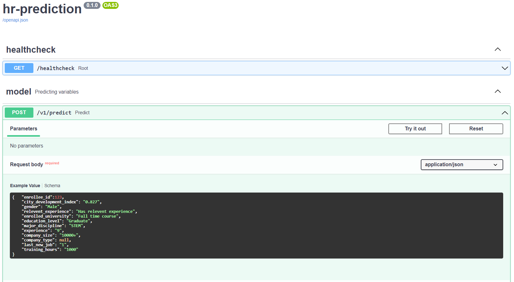
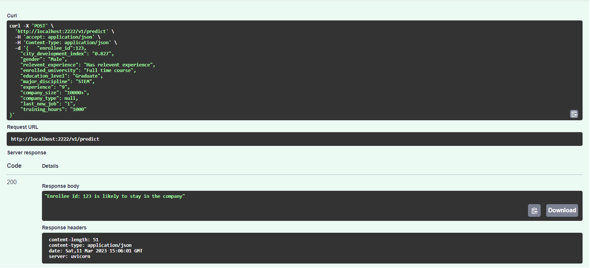

<h4 align='center'>HR Machine Learning</h4>

<p align='center'>
    

</p>

<p align='center'> 
    <a href='#about'>About</a> . 
    <a href='#prerequisites-for-development'>Prerequisites for Development</a> .
    <a href='#getting-started'>Getting Started</a> .
</p>

---
## About

This repository host **Python based scripts for HR Machine Learning**.


## Prerequisites for Development
- Python version >= 3.9, <3.10
- Bash shell/unix terminal/git bash (for Windows)

## Getting Started
### Conda Environment:
```
# cd to preferred repository
git clone https://github.com/Bcpeh/hr-machine-learning.git

# creating a new conda environment
conda create -n myenv python=3.9

# installing required packages
pip install -r requirements.txt

# Running fastapi
python run.py
```

## Running Inference
#### Once your localhost is running visit http://localhost:2222/models
Example of sending an inference request via Swagger UI:

Example of output:

Example of sending an inference request via command line:
```
curl -X 'POST' \
  'http://localhost:2222/v1/predict' \
  -H 'accept: application/json' \
  -H 'Content-Type: application/json' \
  -d '{
    "enrollee_id": 12,
    "city_development_index": "0.827",
    "gender": "Male",
    "relevent_experience": "Has relevent experience",
    "enrolled_university": "Full time course",
    "education_level": "Graduate",
    "major_discipline": "STEM",
    "experience": "9",
    "company_size": "<10",
    "company_type": null,
    "last_new_job": "1",
    "training_hours": "21"
}
```